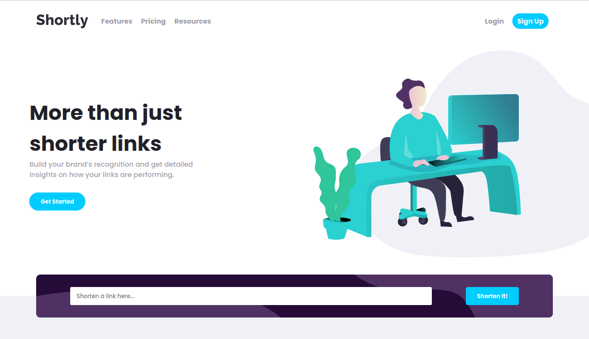

# Frontend Mentor - Shortly URL shortening API Challenge solution

This is a solution to the [Shortly URL shortening API Challenge challenge on Frontend Mentor](https://www.frontendmentor.io/challenges/url-shortening-api-landing-page-2ce3ob-G). Frontend Mentor challenges help you improve your coding skills by building realistic projects. 

## Table of contents

- [Overview](#overview)
  - [The challenge](#the-challenge)
  - [Screenshot](#screenshot)
  - [Links](#links)
- [My process](#my-process)
  - [Built with](#built-with)
  - [What I learned](#what-i-learned)
- [Author](#author)

## Overview

### The challenge

Users should be able to:

- View the optimal layout for the site depending on their device's screen size
- Shorten any valid URL
- See a list of their shortened links, even after refreshing the browser
- Copy the shortened link to their clipboard in a single click
- Receive an error message when the `form` is submitted if:
  - The `input` field is empty

### Screenshot

### Links

- Solution URL: [https://github.com/rochelin-shikamaru/Shortly-URL-shortening-API](https://github.com/rochelin-shikamaru/Shortly-URL-shortening-API)
- Live Site URL: [https://sshortlink.netlify.app](https://sshortlink.netlify.app)

## My process

### Built with

- SCSS
- Flexbox
- [React](https://reactjs.org/) - JS library

### What I learned

I learned to use the useEffect() hooks

## Author

- Website - [rochelin-portfolio](https://rochelin-portfolio.netlify.app/)
- Frontend Mentor - [@rochelin-shikamaru](https://www.frontendmentor.io/profile/rochelin-shikamaru)
- Twitter - [@rochelin9](https://twitter.com/rochelin9)

